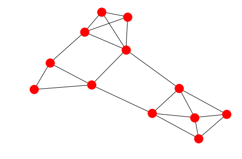
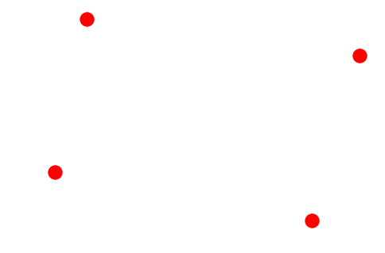
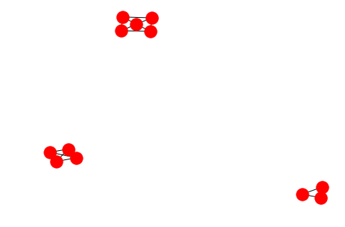

# Highly Connected Subgraphs (HCS)

---

Python implementation of [Hartuv, Erez, and Ron Shamir. "A clustering algorithm based on graph connectivity." Information processing letters 76.4-6 (2000): 175-181.](https://www.researchgate.net/profile/Erez_Hartuv/publication/222648006_A_Clustering_Algorithm_Based_on_Graph_Connectivity/links/5a141b4da6fdcc63d152b4a5/A-Clustering-Algorithm-Based-on-Graph-Connectivity.pdf)

---

Based on [NetworkX](https://networkx.github.io/) and [Numpy](http://www.numpy.org/)

---

### Usage:

It provides the sample graph which is used in the publication.
It can be created by calling:

```python
G = hcs.create_example_graph()
```


Another easy way to get your graph is by passing the adjacency matrix to `NetworkX`
```python
A = np.eye(4)
G = nx.convert_matrix.from_numpy_array(A)
```


The `NetworkX` graph can be clustered. There are two functions:

* `HCS(G)`: should be called if you want to get `NetworkX` graph that is clustered into the sub-graphs found by `HCS`.
* `labelled_HCS(G)`: should be called if you are just interested in the cluster labels. It returns a list with the cluster assignment for each vertex in G.

The clustered example graph looks like this:



And the labels are:
```
array([1, 1, 1, 1, 1, 2, 2, 2, 2, 3, 3, 3], dtype=uint16)
```


